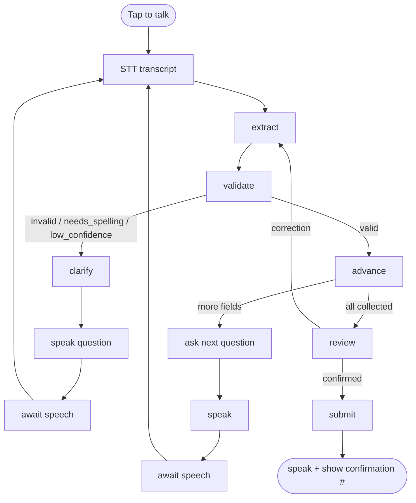

# Architecture

## 1. Shape of the system

This is a **voice-first** app. The browser captures microphone audio and plays back spoken
replies; a minimal Next.js backend brokers the three OpenRouter calls (STT → LLM → TTS).

```
Browser (React / Next.js)
  ├─ Left:  Voice surface (mic capture, audio playback, live transcript)
  └─ Right: Intake form (live, fills as fields are confirmed)
        │
        │  1) audio blob ──▶  POST /api/transcribe ─▶ OpenRouter STT  ─▶ transcript
        │  2) transcript ──▶  POST /api/chat       ─▶ LangGraph agent ─▶ OpenRouter LLM
        │                                              └▶ reply text + updated form state
        └  3) reply text ──▶  POST /api/speak      ─▶ OpenRouter TTS  ─▶ audio bytes ─▶ 🔊
```

Everything is one Next.js app. The "backend" is just a few Route Handlers — no separate
server, no database. **All three AI calls go through OpenRouter.**

## 2. Why this stack

- **TypeScript + React + Next.js** — the most widely used web stack in the Stack Overflow
  Developer Survey. Next.js App Router lets us ship a polished frontend *and* a minimal
  backend (Route Handlers) from one project — the "mostly frontend, minimal backend" brief.
- **Browser audio APIs** — `MediaRecorder` captures mic input; Web Audio / an `<audio>`
  element plays the TTS reply. No native app, no extra SDK.
- **OpenRouter for the whole voice loop** — one API key and base URL covers STT
  (`/api/v1/audio/transcriptions`), the chat LLM (`/api/v1/chat/completions`), and TTS
  (`/api/v1/audio/speech`). These endpoints are OpenAI-compatible, so the same configured
  client is reused.
- **LangGraph.js** — the conversation is a small state machine (collect → validate →
  clarify → advance → review → submit). LangGraph models this natively with typed state and
  conditional edges, in the same TypeScript runtime as the API routes, so no second (Python)
  service is needed.
- **Tailwind + shadcn/ui + Motion** — see [DESIGN.md](DESIGN.md); also the best match for the
  installed design skills.

## 3. The voice loop in detail

1. **Capture.** Patient taps the mic; `MediaRecorder` records until they tap again (or a
   short silence auto-stops). Output is an audio blob (e.g. webm/opus).
2. **Transcribe.** Blob is posted to `/api/transcribe`, which calls OpenRouter STT
   (`OPENROUTER_STT_MODEL`) and returns the transcript text. Transcript is shown as the
   patient's line.
3. **Think.** Transcript is posted to `/api/chat`, which runs one turn of the LangGraph
   agent (`OPENROUTER_LLM_MODEL`). It returns the assistant's reply text and the updated
   intake state.
4. **Speak.** Reply text is posted to `/api/speak`, which calls OpenRouter TTS
   (`OPENROUTER_TTS_MODEL`, voice `OPENROUTER_TTS_VOICE`) and streams back audio. The
   browser plays it while the caption shows the same text and the form updates.
5. **Loop** back to step 1.

**Latency:** the STT → LLM → TTS chain is sequential. Use streaming where it helps (request
PCM from TTS for low-latency playback; stream LLM tokens so the caption appears before audio
finishes). Show a clear "thinking"/"speaking" state so the wait is legible. The bigger wins
are structural — see §3a.

## 3a. Keeping it responsive (don't generate what you can pre-make)

The model should be on the path for *understanding the patient*, not for *speaking*:

- **Assistant wording is deterministic templates, not LLM output.** Every question, the
  greeting, and the clarifications are fixed strings (`lib/agent/nodes.ts` / the `FIELDS`
  registry). The LLM is used only for: extracting a value from the patient's reply,
  judging plausibility (name / reason), and confirm-vs-correction at review. This removes
  a generation step from every turn.
- **Fixed-phrase TTS is pre-rendered / cached.** Because the assistant's lines are fixed,
  their audio is generated once and replayed (`lib/tts-cache.ts`, keyed by model + voice +
  text). Only genuinely dynamic lines (the resolved appointment date, the read-back
  summary, the confirmation number) are synthesized live.
- **The landing demo is fully pre-recorded.** It plays static clips + a manifest with no
  runtime model or TTS at all (see §9).

## 9. Demo assets (`demo/`)

The "Play demo" experience is generated once by `npm run demo:record`, which runs the real
agent over a canned patient script and renders every line to audio:

- `demo/NN-{assistant|patient}.wav` — one clip per utterance (patient = male voice).
- `demo/manifest.json` — ordered steps `{ speaker, text, audio, form }`, where `form` is the
  intake snapshot to display while that clip plays, plus the final `confirmation`.

The website serves these statically; the player just steps through the manifest, plays each
clip, and reveals the form. `npm run demo:play` is the terminal equivalent. The clips are
git-ignored (regenerate with `demo:record`).

## 4. Backend surface (minimal)

| Route             | Method | Purpose                                                          |
| ----------------- | ------ | ---------------------------------------------------------------- |
| `/api/transcribe` | POST   | Audio blob → OpenRouter STT → transcript text.                   |
| `/api/chat`       | POST   | Transcript → one LangGraph agent turn → reply text + updated form. |
| `/api/speak`      | POST   | Reply text → OpenRouter TTS → audio bytes (MP3/PCM).             |
| `/api/submit`     | POST   | Validate completeness, return a mock confirmation number. No DB. |

State (chat history + intake object) is carried in the request/response — the client passes
the prior graph `state` back on each `/chat` call. No session store is required for the demo;
an in-memory map keyed by a session id is enough if persistence is wanted later. The
OpenRouter API key is **server-side only**, never exposed to the browser.

> Implementation note: the handlers are framework-agnostic functions in `lib/api.ts`
> (`chatTurn`, `transcribeTurn`, `speakTurn`, `submitTurn`). For the PoC they're served by a
> tiny Node `http` server (`scripts/server.ts`, `npm run server`); the Next.js frontend phase
> can call the same functions from `app/api/*/route.ts` with no logic changes.

> Note: `/api/transcribe` and `/api/speak` are thin pass-throughs to OpenRouter's audio
> endpoints. They exist so the API key stays on the server.

## 5. The LangGraph agent

### State

- `messages` — the running conversation (transcripts + assistant replies).
- `form` — the structured intake object (all fields nullable until confirmed). Shape is
  defined by the Zod schema in [INTAKE_FORM.md](INTAKE_FORM.md).
- `currentField` — the field being collected right now.
- `status` — `collecting` | `reviewing` | `confirmed`.
- `clarification` — optional flag/kind describing why we're re-asking (e.g. `spell_name`,
  `bad_format`, `low_confidence`).

### Nodes

1. **extract** — given the latest (transcribed) user message and `currentField`, call the
   LLM with **structured output** (Zod) to pull out the value(s). May fill more than one
   field if the patient volunteered extra info.
2. **validate** — check the extracted value with deterministic rules (regex/format from
   [INTAKE_FORM.md](INTAKE_FORM.md)) plus a light LLM judgment ("does this look like a real
   name?"). Produces `valid` / `invalid` / `needs_spelling` / `low_confidence`.
3. **clarify** — when validation fails, craft the corrective question (spoken):
   - `needs_spelling` → ask the patient to spell the name letter by letter, then the next
     `extract` reconstructs it and reads it back.
   - `bad_format` → re-ask with a concrete spoken example (e.g. "month, day, year").
   - `low_confidence` → read back what was heard and ask the patient to confirm.
4. **advance** — commit the confirmed value to `form`, pick the next missing required field,
   and ask its question. When nothing is left, move `status` to `reviewing`.
5. **review** — summarize the whole form aloud and ask the patient to confirm or correct.
6. **submit** — on confirmation, finalize and hand off to `/api/submit`.

### Flow



## 6. OpenRouter integration

- One OpenAI-compatible client pointed at `OPENROUTER_BASE_URL` (`https://openrouter.ai/api/v1`)
  with `OPENROUTER_API_KEY`, reused for all three call types:
  - **STT** → `POST /audio/transcriptions`, model `OPENROUTER_STT_MODEL`.
  - **LLM** → `POST /chat/completions` (via LangChain's chat model), `OPENROUTER_LLM_MODEL`.
  - **TTS** → `POST /audio/speech`, model `OPENROUTER_TTS_MODEL`, voice `OPENROUTER_TTS_VOICE`.
- Model ids come from env so they can be swapped without code changes.
- OpenRouter recommends `HTTP-Referer` and `X-Title` headers; set them from
  `OPENROUTER_SITE_URL` and `OPENROUTER_APP_TITLE`.

## 7. Environment variables

Defined in `.env.example` at the repo root (copy to `.env.local`):

| Variable                | Required | Notes                                                |
| ----------------------- | -------- | ---------------------------------------------------- |
| `OPENROUTER_API_KEY`    | yes      | Your OpenRouter token. Server-side only.             |
| `OPENROUTER_BASE_URL`   | yes      | `https://openrouter.ai/api/v1`                       |
| `OPENROUTER_LLM_MODEL`  | yes      | Conversation + extraction model.                     |
| `OPENROUTER_STT_MODEL`  | yes      | Speech-to-text model.                                |
| `OPENROUTER_TTS_MODEL`  | yes      | Text-to-speech model.                                |
| `OPENROUTER_TTS_VOICE`  | no       | Voice id for the TTS model (model-dependent).        |
| `OPENROUTER_SITE_URL`   | no       | Sent as `HTTP-Referer` for OpenRouter attribution.   |
| `OPENROUTER_APP_TITLE`  | no       | Sent as `X-Title`.                                   |
| `NEXT_PUBLIC_APP_NAME`  | no       | Display name in the header.                          |

## 8. Proposed project structure

For reference when implementation begins (not yet created):

```
/
├─ app/
│  ├─ layout.tsx
│  ├─ page.tsx                 # split layout (voice | intake)
│  └─ api/
│     ├─ transcribe/route.ts   # audio → OpenRouter STT → text
│     ├─ chat/route.ts         # text → LangGraph agent turn → reply + form
│     ├─ speak/route.ts        # text → OpenRouter TTS → audio
│     └─ submit/route.ts       # mock submission → confirmation #
├─ components/
│  ├─ voice/                   # MicButton, LevelMeter, TranscriptList, Captions
│  └─ intake/                  # IntakeCard, Section, FieldRow, ProgressBar
├─ lib/
│  ├─ agent/                   # graph.ts, state.ts, nodes.ts, prompts.ts
│  ├─ schema.ts                # Zod intake schema (shared client + server)
│  ├─ validation.ts            # field validators
│  ├─ openrouter.ts            # shared client; llm() / transcribe() / speak() helpers
│  └─ audio/                   # browser recorder + player helpers
├─ scripts/                    # PoC harnesses (see PLAN.md)
├─ docs/                       # this specification
└─ .env.example
```
